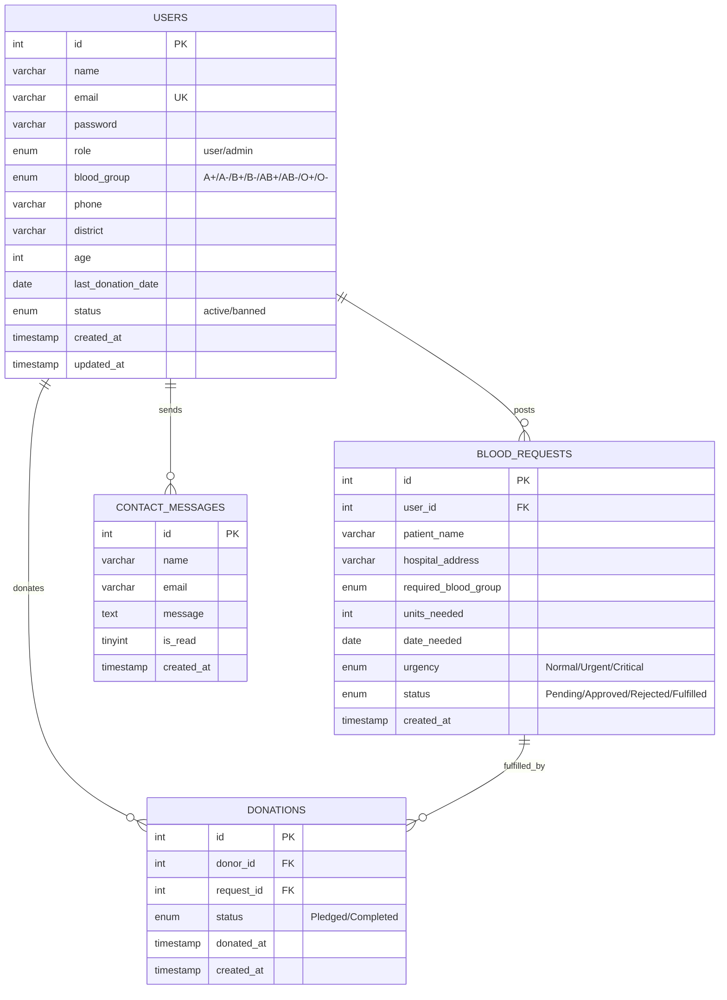

# 🩸 Blood Donation System — Full-Stack Web Application

## Project Overview

A **role-based Blood Donation Management System** with Admin & User panels, featuring secure authentication, 90-day donation rules, blood request moderation, and donor search functionality.

**Stack:** HTML, CSS, JavaScript, PHP, MySQL  
**Theme:** Blood Donation — "Donate Blood, Save Life"

---

## Project Structure

```
blood-donation-system/
│
├── README.md                     # Setup instructions (mandatory)
├── database/
│   └── blood_donation.sql        # Full database schema + seed data
│
├── config/
│   ├── db.php                    # Database connection (PDO)
│   └── session.php               # Session management & access control helpers
│
├── assets/
│   ├── css/
│   │   ├── style.css             # Global styles, variables, typography
│   │   ├── home.css              # Home page specific styles
│   │   ├── auth.css              # Login/Register page styles
│   │   ├── dashboard.css         # User & Admin dashboard styles
│   │   └── components.css        # Reusable component styles (cards, modals, tables)
│   ├── js/
│   │   ├── main.js               # Global scripts (nav toggle, animations)
│   │   ├── validation.js         # Client-side form validation
│   │   ├── search.js             # AJAX donor search functionality
│   │   └── dashboard.js          # Dashboard charts & interactivity
│   └── images/
│       ├── logo.png              # Site logo
│       ├── hero-bg.jpg           # Hero section background
│       └── icons/                # Blood group icons, UI icons
│
├── includes/
│   ├── header.php                # Common header with nav (role-aware)
│   ├── footer.php                # Common footer
│   └── functions.php             # Utility functions (sanitize, redirect, flash msgs)
│
├── ── PUBLIC PAGES ──
├── index.php                     # 🏠 Home Page (Hero, Live Stats, Recent Requests)
├── search_donors.php             # 🔍 Search Donors (blood group + district filter)
├── about.php                     # ℹ️ About Us page
├── contact.php                   # 📞 Contact Us (with form → DB)
│
├── ── AUTHENTICATION ──
├── register.php                  # 📝 User Registration
├── login.php                     # 🔐 Login (role-based redirect)
├── logout.php                    # 🚪 Logout & session destroy
│
├── ── USER PANEL ──
├── user/
│   ├── dashboard.php             # 📊 User Dashboard Home
│   ├── profile.php               # 👤 View & Edit Profile + Last Donation Date
│   ├── request_blood.php         # 🩸 Post a Blood Request (→ Pending)
│   ├── my_requests.php           # 📋 My Requests History (status tracking)
│   ├── available_requests.php    # 📢 Feed: Approved requests + "I Want to Donate"
│   └── donation_history.php      # 📜 My Donation History
│
├── ── ADMIN PANEL ──
└── admin/
    ├── dashboard.php             # 📊 Admin Dashboard (widgets & stats)
    ├── manage_users.php          # 👥 View/Delete/Ban Users
    ├── manage_requests.php       # 📝 Approve/Reject Pending Blood Requests
    ├── manage_donations.php      # 🩸 Track & Complete Donations
    └── contact_messages.php      # 📬 View Contact Form Submissions
```

---

## Database Schema (MySQL)

### ER Diagram



### Table Details

| Table | Purpose | Key Fields |
|-------|---------|------------|
| `users` | All registered users (donors & admins) | `role` (user/admin), `blood_group`, `district`, `last_donation_date`, `status` |
| `blood_requests` | Blood requests posted by users | `status` (Pending→Approved→Fulfilled), `urgency`, `required_blood_group` |
| `donations` | Tracks who pledged/donated for which request | `donor_id`, `request_id`, `status` (Pledged/Completed) |
| `contact_messages` | Contact form submissions | `is_read` for admin tracking |

---

## Phase-by-Phase Implementation

### Phase 1: Public Interface (Frontend)

#### [NEW] [index.php](file:///e:/Sakib%20Project/blood-donation-system/index.php)
- **Hero Section** with animated gradient background, "Donate Blood, Save Life" heading, CTA buttons
- **Live Stats Section**: Total registered donors, successful donations, active requests (COUNT queries from DB)
- **Recent Urgent Requests**: Slider/carousel showing only `Approved` requests with urgency indicators
- **How It Works**: 3-step visual guide (Register → Search/Request → Donate)
- Responsive design with smooth scroll animations

#### [NEW] [search_donors.php](file:///e:/Sakib%20Project/blood-donation-system/search_donors.php)
- **Search Form**: Blood group dropdown + District dropdown
- **Results Grid**: Shows donor name, blood group, district, age
- **Contact Hidden**: Phone/email replaced with "Login to view contact details" for non-logged-in visitors
- AJAX-powered search with loading spinners

#### [NEW] [about.php](file:///e:/Sakib%20Project/blood-donation-system/about.php)
- Project mission, vision, team info
- Blood donation facts/statistics section
- Eligibility criteria info

#### [NEW] [contact.php](file:///e:/Sakib%20Project/blood-donation-system/contact.php)
- Contact form (Name, Email, Message) → saves to `contact_messages` table
- Client-side + server-side validation
- Success/error flash messages

---

### Phase 2: Authentication System

#### [NEW] [register.php](file:///e:/Sakib%20Project/blood-donation-system/register.php)
- **Fields**: Name, Email, Password, Confirm Password, Blood Group, Phone, District, Age, Last Donation Date
- **JS Validation**: Password match check, age ≥ 18, required fields
- **PHP Validation**: Email uniqueness check, `password_hash()` for secure storage
- Default role = `'user'`

#### [NEW] [login.php](file:///e:/Sakib%20Project/blood-donation-system/login.php)
- Email + Password login with `password_verify()`
- **Role-based redirect**: 
  - `role == 'admin'` → `admin/dashboard.php`
  - `role == 'user'` → `user/dashboard.php`
- Banned user check → deny access with error message
- Session management with `session_regenerate_id()`

#### [NEW] [logout.php](file:///e:/Sakib%20Project/blood-donation-system/logout.php)
- `session_destroy()`, redirect to `login.php`

---

### Phase 3: User Panel (Limited Access)

> [!IMPORTANT]
> Every page in `user/` will include a session check via `config/session.php` — redirects to login if not authenticated, or to home if role is not `'user'`.

#### [NEW] [user/dashboard.php](file:///e:/Sakib%20Project/blood-donation-system/user/dashboard.php)
- Welcome message with user name
- **Stats Cards**: Total past donations, Active blood requests, Days since last donation
- Quick action buttons

#### [NEW] [user/profile.php](file:///e:/Sakib%20Project/blood-donation-system/user/profile.php)
- View & update profile details (Name, Phone, District, etc.)
- **Key Feature**: Update "Last Donation Date" (for external donations)
- Password change with old password verification

#### [NEW] [user/request_blood.php](file:///e:/Sakib%20Project/blood-donation-system/user/request_blood.php)
- Form: Patient Name, Hospital, Blood Group, Units, Date Needed, Urgency
- Submits with `status = 'Pending'` → waits for admin approval
- Success confirmation with request tracking number

#### [NEW] [user/my_requests.php](file:///e:/Sakib%20Project/blood-donation-system/user/my_requests.php)
- Table of all user's requests with status badges (Pending 🟡 / Approved 🟢 / Rejected 🔴 / Fulfilled ✅)
- Filter by status

#### [NEW] [user/available_requests.php](file:///e:/Sakib%20Project/blood-donation-system/user/available_requests.php)
- Feed of all `Approved` requests from other users
- Each has **"I Want to Donate"** button
- **Self-block**: Can't donate to own request → error toast
- **90-Day Rule**: PHP checks `last_donation_date` — if < 90 days → error: "You are not eligible to donate yet. Please wait X more days."

#### [NEW] [user/donation_history.php](file:///e:/Sakib%20Project/blood-donation-system/user/donation_history.php)
- Table showing: Date, Patient Name, Hospital, Blood Group, Status (Pledged/Completed)

---

### Phase 4: Admin Panel (Full Access)

> [!IMPORTANT]
> Every page in `admin/` checks `role == 'admin'` — non-admins are kicked to login page.

#### [NEW] [admin/dashboard.php](file:///e:/Sakib%20Project/blood-donation-system/admin/dashboard.php)
- **Stat Widgets**: Total Users, Pending Requests, Approved Requests, Total Successful Donations
- Recent activity log
- Charts (using Chart.js) — donations per month, requests by blood group

#### [NEW] [admin/manage_users.php](file:///e:/Sakib%20Project/blood-donation-system/admin/manage_users.php)
- Full user list in a searchable, sortable table
- Actions: View Profile, Delete, Ban/Unban
- Search by name/email/blood group

#### [NEW] [admin/manage_requests.php](file:///e:/Sakib%20Project/blood-donation-system/admin/manage_requests.php)
- All `Pending` blood requests for moderation
- **Approve** or **Reject** buttons with confirmation modal
- Approved requests appear in user feed

#### [NEW] [admin/manage_donations.php](file:///e:/Sakib%20Project/blood-donation-system/admin/manage_donations.php)
- Notifications when someone clicks "I Want to Donate"
- Admin marks donation as `Completed` → auto-updates donor's `last_donation_date` to today
- Track all pledged and completed donations

#### [NEW] [admin/contact_messages.php](file:///e:/Sakib%20Project/blood-donation-system/admin/contact_messages.php)
- View all contact form submissions
- Mark as read/unread
- Delete old messages

---

### Phase 5: Technical & Security Features

#### Security Measures
| Feature | Implementation |
|---------|---------------|
| **Password Hashing** | `password_hash()` with `PASSWORD_DEFAULT` (bcrypt) |
| **SQL Injection Prevention** | PDO Prepared Statements throughout |
| **Session Security** | `session_regenerate_id()` on login, role checks on every protected page |
| **Input Validation** | Both client-side (JS) and server-side (PHP) |
| **XSS Prevention** | `htmlspecialchars()` on all output |
| **CSRF Protection** | Token-based form verification |
| **Access Control** | URL-direct-access blocked — users can't access admin pages and vice versa |

#### UI/UX Design Approach
- **Color Palette**: Deep red (#DC143C) primary, white, soft grays — blood donation theme
- **Typography**: Google Fonts (Inter for body, Poppins for headings)
- **Responsive**: Mobile-first CSS with media queries
- **Animations**: Smooth page transitions, hover effects on cards, fade-in on scroll
- **Dark/Light sections**: Alternating for visual rhythm
- **Toast notifications**: For success/error feedback
- **Loading states**: Spinners during AJAX operations

---

## Deployment Strategy

| Item | Platform | Notes |
|------|----------|-------|
| **Frontend + Backend** | [InfinityFree](https://www.infinityfree.com/) or [000webhost](https://www.000webhost.com/) | Free PHP + MySQL hosting |
| **Alternative** | [Render](https://render.com/) with Docker | If using Node.js alternative |
| **Database** | MySQL (included with PHP host) | Import `blood_donation.sql` |
| **Code Repository** | GitHub | Public repo with README.md |
| **Domain** | Free subdomain from host | e.g., `blooddonation.infinityfree.com` |

---

## Verification Plan

### Automated Tests
- SQL injection test: Try `' OR '1'='1` in login form
- Session hijacking test: Access `admin/dashboard.php` as user → must redirect
- Form validation test: Submit empty forms, invalid emails, age < 18
- 90-day rule test: Set `last_donation_date` to recent date → verify rejection

### Manual Verification
- Register a new user → verify email uniqueness
- Login as user → post blood request → verify Pending status
- Login as admin → approve request → verify it appears in user feed
- User clicks "I Want to Donate" → admin completes it → verify `last_donation_date` updates
- Search donors without login → verify contact info is hidden
- Test on mobile viewport → verify responsiveness

---

## Deliverables Checklist (from CSE472 Assignment)

- [ ] **Cover Page**: Course, title, name, ID, GitHub link, Live website link
- [ ] **Objectives & Scope**: Brief application overview
- [ ] **Architecture Diagram**: Client → PHP Server → MySQL flow
- [ ] **Database Schema**: ER diagram + table definitions
- [ ] **Features Screenshots**: Login, CRUD, Search with explanations
- [ ] **Validation & Security**: Documentation of secure coding practices
- [ ] **Testing**: Minimum 5 test cases (valid, invalid, edge cases)
- [ ] **Development Timeline**: Phase-wise time log
- [ ] **Reflection**: Lessons learned & challenges
- [ ] **References**: Harvard style citations

---

## Open Questions

> [!IMPORTANT]
> **Hosting preference?** Do you want to use InfinityFree (easiest for PHP+MySQL), or do you prefer another platform like 000webhost or Render?

> [!IMPORTANT]
> **Admin seeding?** Should I create a default admin account in the SQL seed file (e.g., `admin@blooddonation.com` / `admin123`), or do you want a separate admin registration mechanism?

> [!IMPORTANT]
> **Chart.js for admin dashboard?** The guideline mentions gorgeous UI. Should I include Chart.js for donation statistics charts, or keep it simpler with just stat cards?

> [!IMPORTANT]
> **CSS Framework preference?** The guideline suggests Tailwind/Bootstrap. Do you want me to use **vanilla CSS** (more unique, custom design), **Bootstrap** (faster development), or **Tailwind** (utility-first)?
